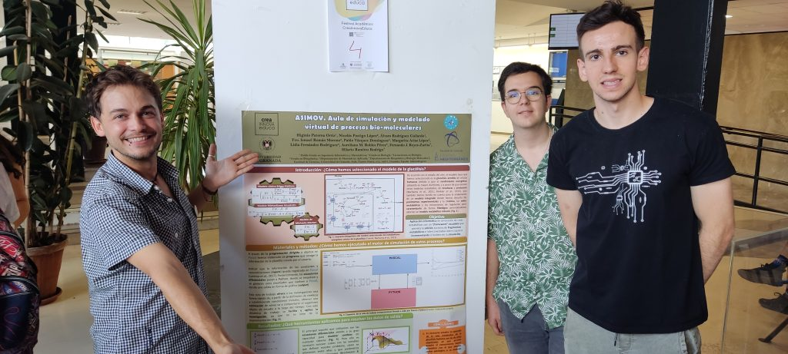
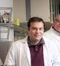
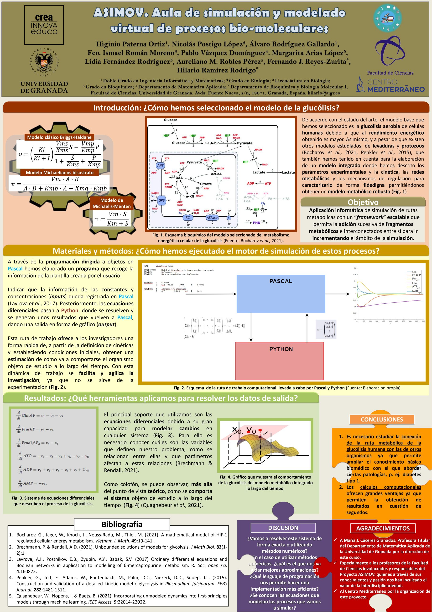
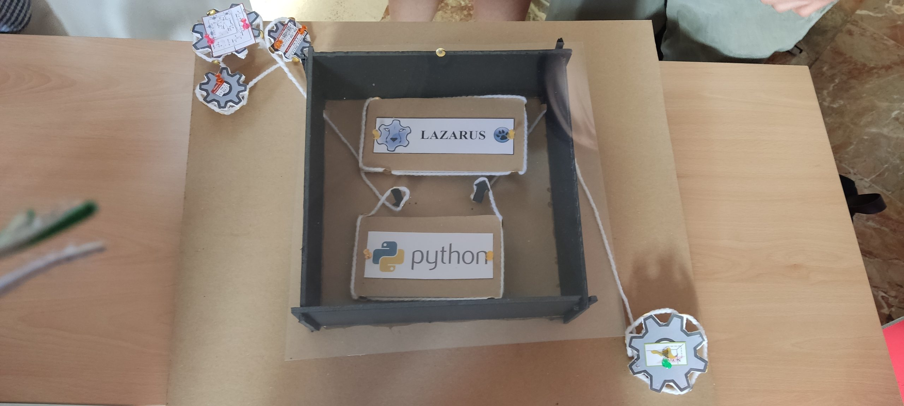
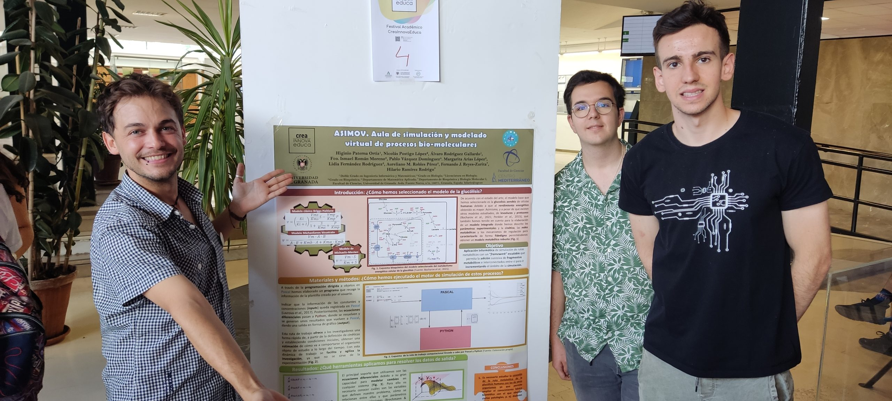
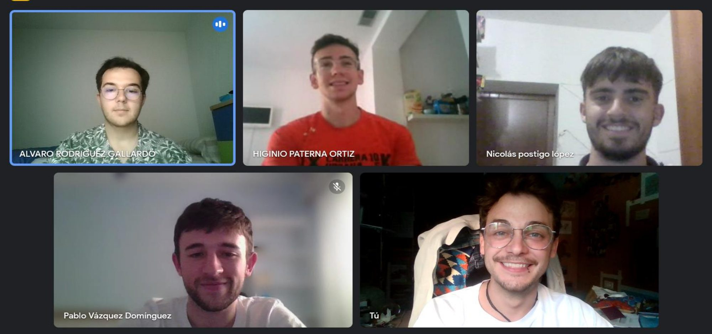

Proyecto en Bioquímica

# ASIMOV. Aula de simulación y modelado virtual de procesos bio-moleculares

## Primera Edición: Curso 2022/2023

### Alumnado encargado del proyecto

Este proyecto se lleva a cabo gracias al trabajo y dedicación de dos estudiantes de biología, dos estudiantes del doble grado en ingeniería informática y matemáticas y un estudiante de biotecnología.

##### Higinio Paterna Ortiz

Alumno del Doble Grado en Ingeniería Informática y Matemáticas

##### Álvaro Rodríguez Gallardo

Alumno del Doble Grado en Ingeniería Informática y Matemáticas

##### Pablo Vázquez Domínguez Domínguez

Alumno del Grado en Biotecnología

##### Nicolás Postigo López

Alumno del Grado en Biología 

##### Fco. Ismael Román Moreno

Licenciado en Biología 

### Profesorado

##### Hilario Ramírez Rodrigo

Colaborador Extraordinario, Departamento de Bioquímica y Biología Molecular I

###### [hilario@ugr.es](mailto:hilario@ugr.es)

##### Fernando Reyes Zurita

Profesor titular de universidad, Departamento de Bioquímica y Biología Molecular I

###### [ferjes@ugr.es](mailto:ferjes@ugr.es)

##### Juan Sainz Pérez

Profesor ayudante doctor, Departamento de Bioquímica y Biología Molecular I

###### [jsainz@ugr.es](mailto:jsainz@ugr.es)

##### Aureliano M. Robles Pérez

Profesor titular de universidad, Departamento de Matemática Aplicada

###### [arobles@ugr.es](mailto:arobles@ugr.es)

##### María José Sáez Lara

Profesora titular de universidad, Departamento de Bioquímica y Biología Molecular I

###### [mjsaez@ugr.es](mailto:mjsaez@ugr.es)

##### Lidia Fernández Rodríguez

Profesora titular de universidad, Departamento de Matemática Aplicada

###### [lidiafr@ugr.es](mailto:lidiafr@ugr.es)

##### Margarita Arias López

Profesora titular de universidad, Departamento de Matemática Aplicada

###### [marias@ugr.es](mailto:marias@ugr.es)

#### Metas alcanzadas en esta fase

Durante la primera edición del proyecto, se llevó a cabo un estudio bibliográfico detallado de la glucolisis; se seleccionaron las descripciones formales más idóneas, en términos de ecuaciones y se estudiaron diferentes juegos de valores paramétricos obtenidos experimentalmente bajo diferentes situaciones fisiológicas. Se inició el abordaje de los objetivos 1 y 2, proponiéndose un primer diseño del “workflow” a emplear y un posible protocolo de descripción formal de los sistemas metabólicos. Respecto al objetivo 3, se definieron las librerías a emplear y se ensayó un prototipo preliminar de código para llevar a cabo la integración de ecuaciones diferenciales y se discutieron algunos problemas teóricos asociados (p.e.: valores negativos de concentración de metabolitos).

### Camino por recorrer

Es obvio que se trata de un proyecto ambicioso y complejo cuyo abordaje ha de ser progresivo. En este momento es prioritario definir una adecuada estructura y representación interna de los datos experimentales. Asimismo sería prioritario disponer de un primer prototipo funcional de motor de integración capaz de operar con datos externos. Finalmente, será necesario disponer también de una interfaz gráfica, básica, de interacción con la persona usuaria.

### Opiniones Anónimas Del Alumnado​

"." "." "." "."Previous image Next image

## Únete

###### ¿Te interesa este proyecto? Escribe a su persona de contacto:

##### [hilario@ugr.es](mailto:hilario@ugr.es)
