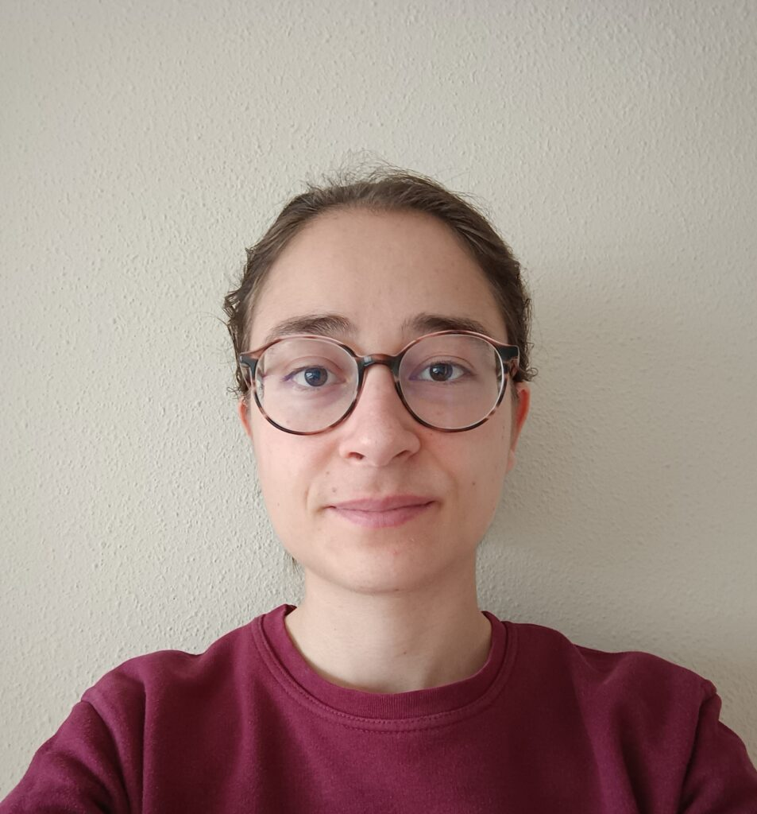

Proyecto en Bioquímica

# ASIMOV. Aula de simulación y modelado virtual de procesos bio-moleculares

## Segunda Edición: Curso 2023/2024

### Alumnado encargado del proyecto

Este proyecto se lleva a cabo gracias al trabajo y dedicación de ...

##### 

Alba Torres Gómez

Alumna del Grado en ...

##### 

Miguel Cuberos **Muñoz**

Alumno del Grado en ...

##### 

Lorena Gómez Gómez

Alumna del Grado en ... 

##### 

Elena Torres Fernández

Alumna del Doble Grado en Ingeniería Informática y Matemáticas

### Profesorado

##### Hilario Ramírez Rodrigo

Colaborador Extraordinario, Departamento de Bioquímica y Biología Molecular I

###### [hilario@ugr.es](mailto:hilario@ugr.es)

##### Fernando Reyes Zurita

Profesor titular de universidad, Departamento de Bioquímica y Biología Molecular I

###### [ferjes@ugr.es](mailto:ferjes@ugr.es)

##### Juan Sainz Pérez

Profesor ayudante doctor, Departamento de Bioquímica y Biología Molecular I

###### [jsainz@ugr.es](mailto:jsainz@ugr.es)

##### Lidia Fernández Rodríguez

Profesora titular de universidad, Departamento de Matemática Aplicada

###### [lidiafr@ugr.es](mailto:lidiafr@ugr.es)

##### Aureliano M. Robles Pérez

Profesor titular de universidad, Departamento de Matemática Aplicada

###### [arobles@ugr.es](mailto:arobles@ugr.es)

### Metas alcanzadas en esta fase

...

### Camino por recorrer

...

### Opiniones anónimas del alumnado

**¿...?**

"..."

**¿...?**

"...."

**¿...?**

"..."

**¿...?**

"...."

## Únete

###### ¿Te interesa este proyecto? Escribe a su persona de contacto:

##### [hilario@ugr.es](mailto:hilario@ugr.es)
