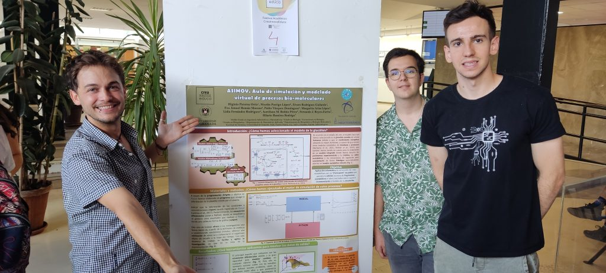
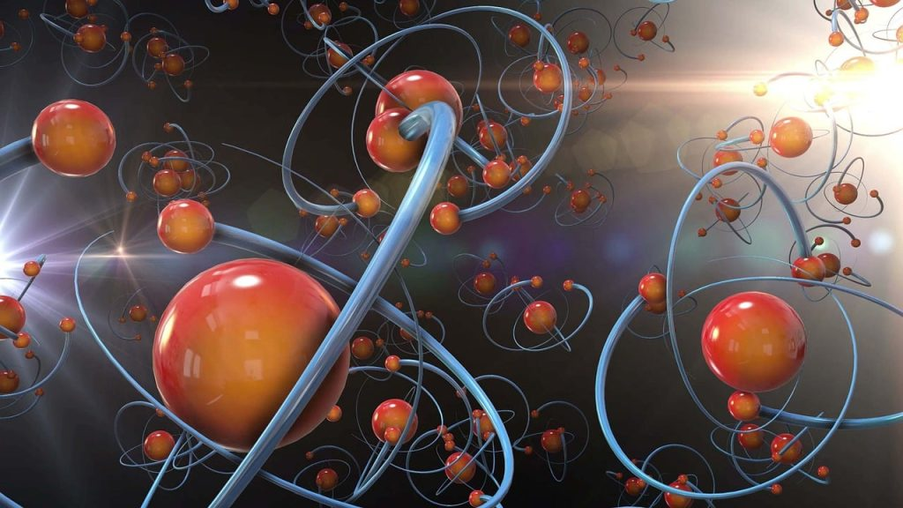

Proyecto en Bioquímica

#### ASIMOV. Aula de simulación y modelado virtual de procesos bio-moleculares

## ¿En qué consiste este proyecto?

Se trata de un proyecto cuyo objetivo final es el desarrollo de una herramienta informática flexible y escalable para la simulación de procesos metabólicos. Básicamente, la aplicación deberá aceptar, como entrada, la descripción formal de los sistemas dinámicos, en términos de ecuaciones diferenciales, y disponer de un motor de integración numérica capaz de resolverlos. La aplicación estará dotada, además, de una interfaz gráfica adecuada, para representar convenientemente la evolución del sistema a partir de condiciones iniciales dadas.

La idea es que la herramienta permita la incorporación sucesiva de fragmentos metabólicos, de forma que las simulaciones puedan escalarse, abarcando conjuntos cada vez mayores de procesos metabólicos y sea suficientemente flexible como para que pueda contemplar interacciones dinámicas complejas entre ellos.

  

Objetivos

Los objetivos que se plantean son los siguientes:

1. 1. Definir un ecosistema de programación adecuado que facilite al máximo la implementación del proyecto, tanto en términos de lenguajes informáticos a emplear como en términos de diseño del “workflow” adecuado.
    2. Definir el protocolo de entrada de datos, incluyendo la descripción formal de los procesos metabólicos (ecuaciones del sistema) y la implementación de a) una interfaz de entrada y b) una adecuada representación interna de los datos experimentales.
    3. Diseñar un motor de integración eficiente, capaz de resolver sistemas de ecuaciones diferenciales simultáneas y no lineales.
    4. Diseñar una interfaz gráfica amigable, que facilite tanto la entrada de datos experimentales como la visualización (y, eventualmente, el análisis) de los resultados obtenidos en cada simulación.

## Fases del proyecto

#### Primera edición: curso 2022/2023

#### Segunda edición: curso 2023/2024
