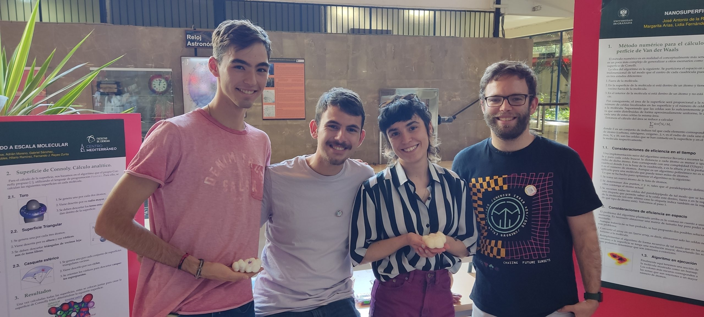

Proyecto en Bioquímica

# Nanosuperficies. El mundo a escala molecular

## Primera Edición: Curso 2022/2023

### Alumnado encargado del proyecto

Este proyecto se lleva a cabo gracias al trabajo y dedicación de dos estudiantes del doble grado en ingeniería informática y matemáticas y dos estudiantes del doble grado en física y matemáticas.

##### José Antonio De La Rosa Cubero

Alumno del Doble Grado en Ingeniería Informática y Matemáticas

##### Adrián Moreno Sánchez

Alumno del Doble Grado en Física y Matemáticas

##### Dolores Esteve Díaz

Alumna Doble Grado en Física y Matemáticas

##### Gabriel Sánchez Muñoz

Alumno del Doble Grado en Ingeniería Informática y Matemáticas 

### Profesorado

##### Hilario Ramírez Rodrigo

Colaborador Extraordinario, Departamento de Bioquímica y Biología Molecular I

###### [hilario@ugr.es](mailto:hilario@ugr.es)

##### Fernando Reyes Zurita

Profesor titular de universidad, Departamento de Bioquímica y Biología Molecular I

###### [ferjes@ugr.es](mailto:ferjes@ugr.es)

##### Juan Sainz Pérez

Profesor ayudante doctor, Departamento de Bioquímica y Biología Molecular I

###### [jsainz@ugr.es](mailto:jsainz@ugr.es)

##### Aureliano M. Robles Pérez

Profesor titular de universidad, Departamento de Matemática Aplicada

###### [arobles@ugr.es](mailto:arobles@ugr.es)

##### María José Sáez Lara

Profesora titular de universidad, Departamento de Bioquímica y Biología Molecular I

###### [mjsaez@ugr.es](mailto:mjsaez@ugr.es)

##### Lidia Fernández Rodríguez

Profesora titular de universidad, Departamento de Matemática Aplicada

###### [lidiafr@ugr.es](mailto:lidiafr@ugr.es)

##### Margarita Arias López

Profesora titular de universidad, Departamento de Matemática Aplicada

###### [marias@ugr.es](mailto:marias@ugr.es)

### Metas alcanzadas en esta fase

Durante la primera edición del proyecto, se llevó a cabo un estudio detallado de las diferentes estrategias y su bibliografía asociada. Se definió el entorno de programación adecuado y se implementó un primer prototipo de algoritmo numérico. Se avanzó en la definición de las herramientas geométricas necesarias para la implementación de los algoritmos semi-analítico y analítico. En este último caso se detalló la descripción más explícita encontrada en la literatura y se hicieron propuestas para su posible implementación. 

### Camino por recorrer

Es obvio que se trata de un proyecto ambicioso y complejo cuyo abordaje ha de ser progresivo. Durante la segunda edición del proyecto deberá prestarse una atención prioritaria a la optimización del algoritmo numérico, que en este momento solo puede resolver superficies para un número limitado de átomos. Asimismo, sería deseable avanzar ya el primer prototipo funcional de algoritmo semianalítico, potencialmente mucho más eficiente que el anterior. Finalmente, sería deseable lograr un impulso decisivo a la implementación del algoritmo analítico y, eventualmente, la obtención de una versión preliminar, aunque sea básica.

### Opiniones Anónimas Del Alumnado​

"." "." "." "."Previous image Next image

## Únete

###### ¿Te interesa este proyecto? Escribe a su persona de contacto:

##### [hilario@ugr.es](mailto:hilario@ugr.es)
