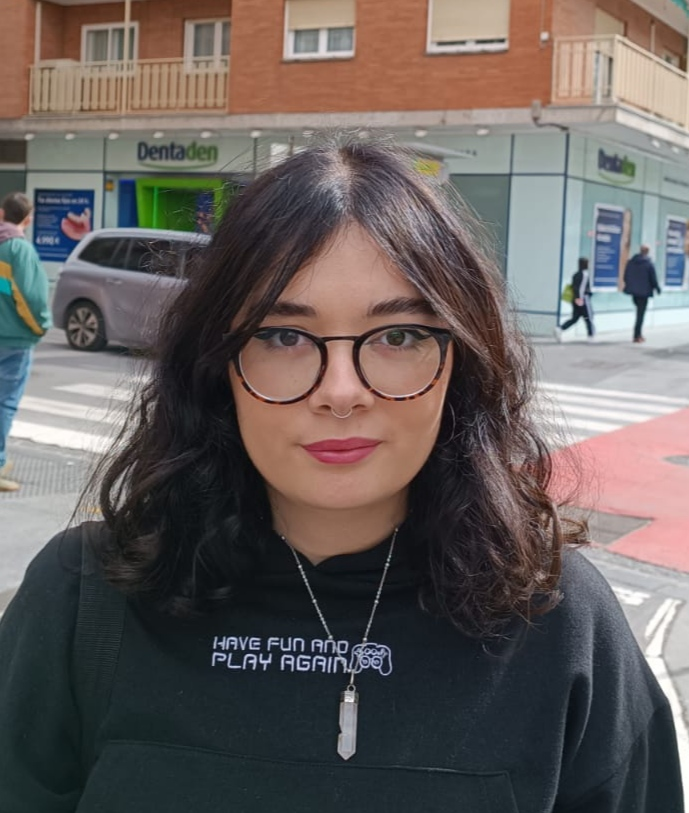

Proyecto en Bioquímica

#### Nanosuperficies. El mundo a escala molecular

## Segunda Edición: Curso 2023/2024

#### Alumnado encargado del proyecto

Este proyecto se lleva a cabo gracias al trabajo y dedicación de ...

##### Cloe Biedma López

Alumna del Grado en ... 

##### Ángela Hidalgo Valverde

Alumna del Grado en Física

##### Jorge Rueda de Gracia

Alumno del Grado en ...

### Profesorado

##### Hilario Ramírez Rodrigo

Colaborador Extraordinario, Departamento de Bioquímica y Biología Molecular I

###### [hilario@ugr.es](mailto:hilario@ugr.es)

##### Fernando Reyes Zurita

Profesor titular de universidad, Departamento de Bioquímica y Biología Molecular I

###### [ferjes@ugr.es](mailto:ferjes@ugr.es)

##### Aureliano M. Robles Pérez

Profesor titular de universidad, Departamento de Matemática Aplicada

###### [arobles@ugr.es](mailto:arobles@ugr.es)

##### María José Sáez Lara

Profesora titular de universidad, Departamento de Bioquímica y Biología Molecular I

###### [mjsaez@ugr.es](mailto:mjsaez@ugr.es)

##### Margarita Arias López

Profesora titular de universidad, Departamento de Matemática Aplicada

###### [marias@ugr.es](mailto:marias@ugr.es)

### Metas alcanzadas en esta fase

...

### Camino por recorrer

...

#### Opiniones anónimas del alumnado

**¿...?**

"..."

**¿...?**

"...."

**¿...?**

"..."

**¿...?**

"...."

## Únete

###### ¿Te interesa este proyecto? Escribe a su persona de contacto:

##### [hilario@ugr.es](mailto:hilario@ugr.es)
