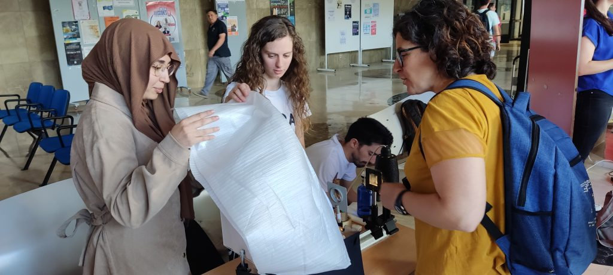
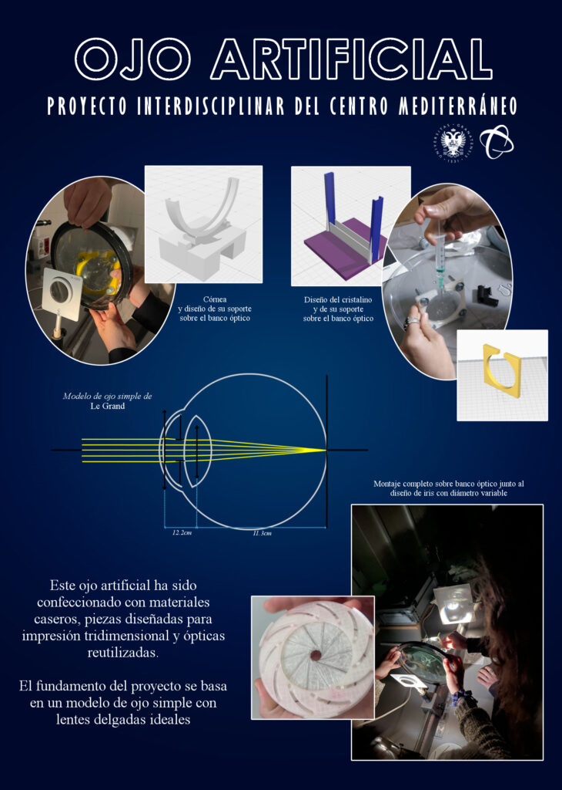
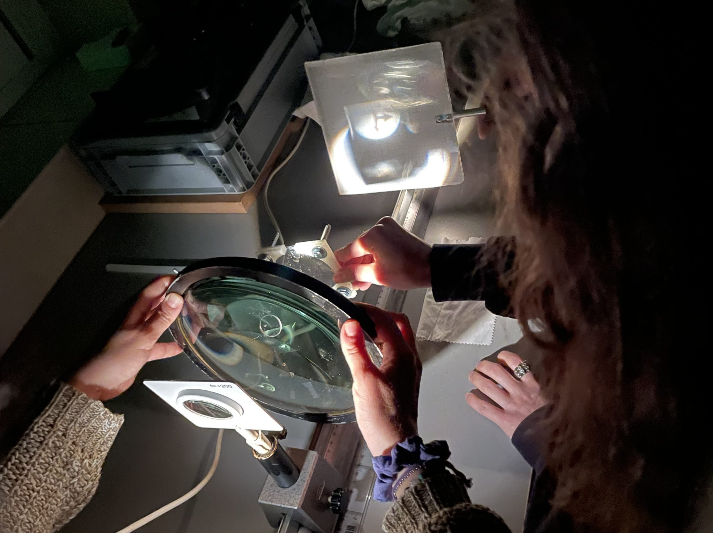
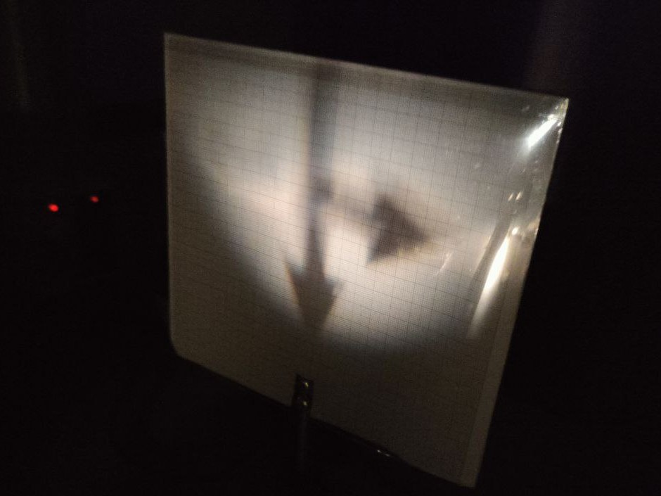
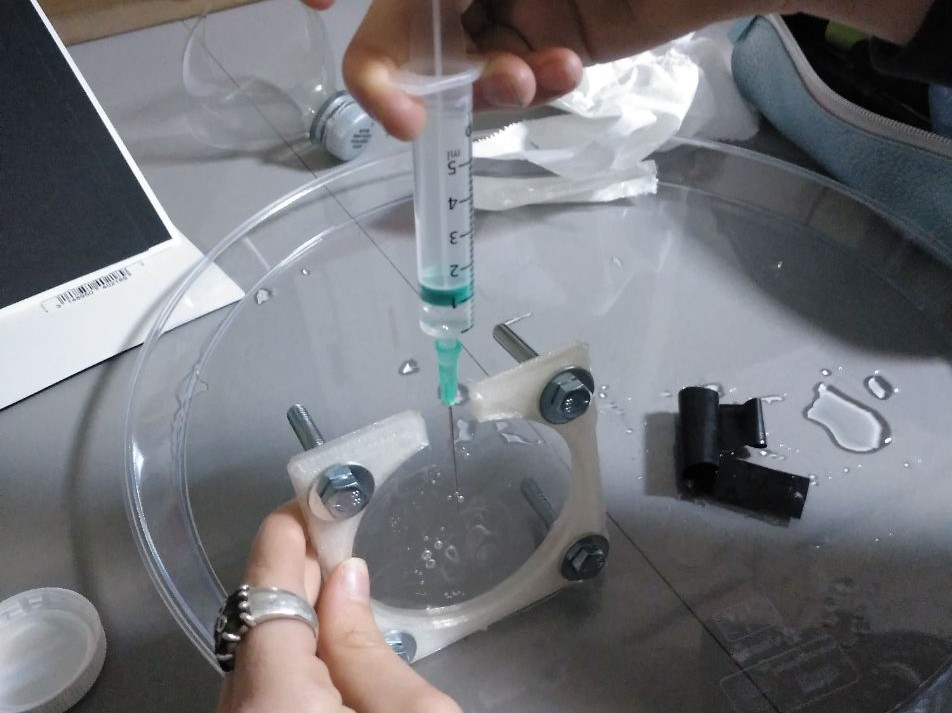
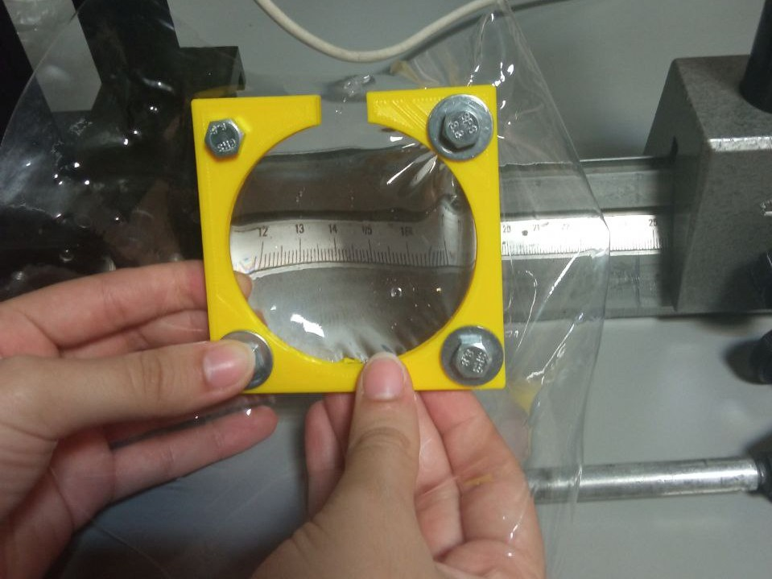
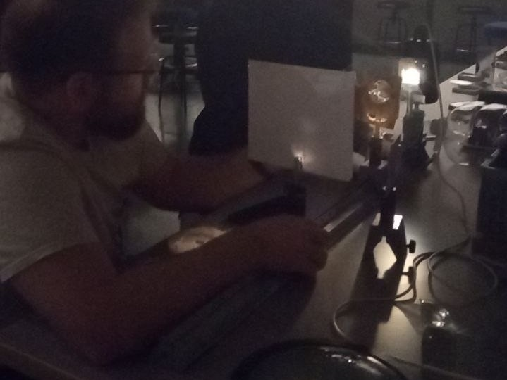
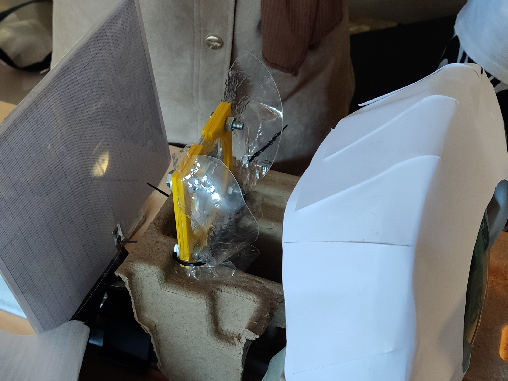

Proyecto en Óptica

# Construcción de un ojo artificial

## Primera Edición: Curso 2022/2023

### Alumnado encargado del proyecto

Este proyecto se lleva a cabo gracias al trabajo y dedicación de tres estudiantes de óptica, un estudiante de física y una de matemáticas.

##### Iván Donaire Pavón

Alumno del Grado en Óptica y Optometría

##### Sabrin Milud Chanboun

Alumna del Grado en Óptica y Optometría

##### Fátima Esperanza Rodríguez Farfach

Alumna del Grado en Óptica y Optometría

##### Paloma Gil Franco

Alumna del Grado en Matemáticas

##### Juan Lucas Pérez Cervantes

Alumno del Grado en Física 

### Profesorado

##### María José Granados Muñoz

Profesora contratada doctora indefinida, Departamento de Física Aplicada

###### [mjgranados@ugr.es](mailto:mjgranados@ugr.es)

##### María de la Natividad Tejada Casado

Profesora Sustituta Interina, Departamento de Óptica

###### [mariatejadac@ugr.es](mailto:mariatejadac@ugr.es)

##### María José Cáceres Granados

Profesora titular de universidad, Departamento de Matemática Aplicada

###### [caceresg@ugr.es](mailto:caceresg@ugr.es)

##### Lidia Fernádez Rodríguez

Profesora titular de universidad, Departamento de Matemática Aplicada

###### [lidiafr@ugr.es](mailto:lidiafr@ugr.es)

##### Ana Belén López Baldomero

Contratos predoctorales ley 14/2011 FPU, Departamento de Óptica

###### [anabelenlb@ugr.es](mailto:anabelenlb@ugr.es)

##### Pilar Granados Delgado

Profesora sustituta interina, Departamento de Óptica

###### [pilargrd@ugr.es](mailto:pilargrd@ugr.es)

### Metas alcanzadas en esta fase

Se ha conseguido construir un sistema óptico similar a un ojo humano usando una lente reciclada (córnea), diafragma elaborado con diseño e impresión 3D (iris), una lente elaborada que contiene agua destilada (cristalino) y una pantalla. Todas las estructuras están sumergidas en aire y apoyadas sobre un banco óptico. Se consiguió la formación de la imagen usando para ello un colimador, elaborado por el alumnado. Se apreciaba imagen incompleta y de calidad mejorable, hallándose el efecto de las aberraciones y los problemas de limitación de campo del sistema óptico formado.

### Camino por recorrer

Optimizar cada parte que conforma el sistema óptico y su soporte. Analizar los distintos ejes que se dan en el ojo real e introducirnos en la optimización de la imagen final obtenida, pudiendo teorizar sobre los fenómenos de aberraciones ópticas del sistema. Por otro lado, se podría plantear la opción de introducir todos los componentes en un medio acuoso y hermético, intentando solventar las dificultades halladas por sus compañeras y compañeros en la edición anterior.

### Opiniones anónimas del alumnado

**¿Qué es lo que más te ha gustado del curso?**

"Trabajar con gente de otras disciplinas ha sido muy interesante y también ha sido una gran oportunidad para aprender nuevas habilidades."

**¿Cómo valoras el grado de aprendizaje que has tenido sobre otras disciplinas?**

"He aprendido mucho sobre todo a la hora de tener una visión espacial para entender la estructura de las piezas impresas"

**¿Cuánto difiere la realidad de lo que imaginaste?**  
"Me esperaba hacer un ojo pero no que funcionase con el fundamente físico que hemos podido reflejar en el proyecto"**¿Cómo te has sentido en el grupo (con el resto de estudiantes y con el profesorado)?** "Me he sentido muy cómodo y escuchado."Previous image Next image

## Únete

###### ¿Te interesa este proyecto? Escribe a su persona de contacto:

##### [pilargrd@ugr.es](mailto:pilargrd@ugr.es)
