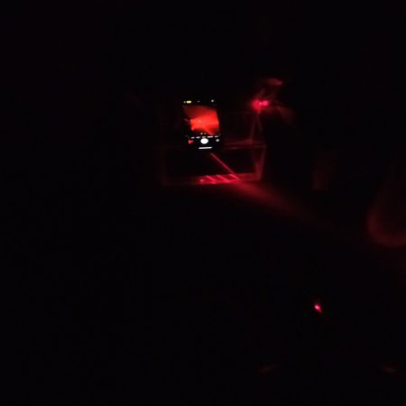

Proyecto en Óptica

#### Construcción de un ojo artificial

## Segunda Edición: Curso 2023/2024

#### Alumnado encargado del proyecto

Este proyecto se lleva a cabo gracias al trabajo y dedicación de dos estudiantes de física, una de matemáticas y una de óptica y optometría.

##### David Aguilar Zafra

Alumno del Grado en Física 

##### María del Rocío Casas Aranda

Alumna del Grado en Física 

##### Alhambra Espigares García

Alumna del Grado en Matemáticas 

##### Erika Hristov Palma

Alumna del Grado en Óptica y Optometría  

### Profesorado

##### María José Granados Muñoz

Profesora contratada doctora indefinida, Departamento de Física Aplicada

###### [mjgranados@ugr.es](mailto:mjgranados@ugr.es)

##### Francesco Martino

Doctor en Física y Ciencias del Espacio con linea de investigación en óptica e investigador, Departamento de Óptica

###### [francesco@ugr.es](mailto:mariatejadac@ugr.es)

##### María José Cáceres Granados

Profesora titular de universidad, Departamento de Matemática Aplicada

###### [caceresg@ugr.es](mailto:caceresg@ugr.es)

##### Lidia Fernádez Rodríguez

Profesora titular de universidad, Departamento de Matemática Aplicada

###### [lidiafr@ugr.es](mailto:lidiafr@ugr.es)

##### Pilar Granados Delgado

Profesora sustituta interina, Departamento de Óptica

###### [pilargrd@ugr.es](mailto:pilargrd@ugr.es)

### Metas alcanzadas en esta fase

...

### Camino por recorrer

...

#### Opiniones anónimas del alumnado

**¿...?**

"..."

**¿...?**

"...."

**¿...?**

"..."

**¿...?**

"...."

## Únete

###### ¿Te interesa este proyecto? Escribe a su persona de contacto:

##### [pilargrd@ugr.es](mailto:pilargrd@ugr.es)
