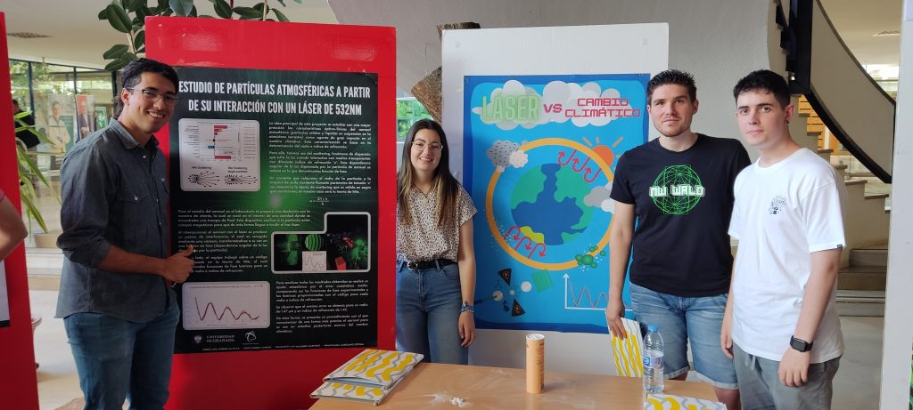
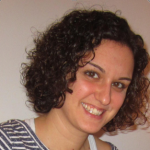
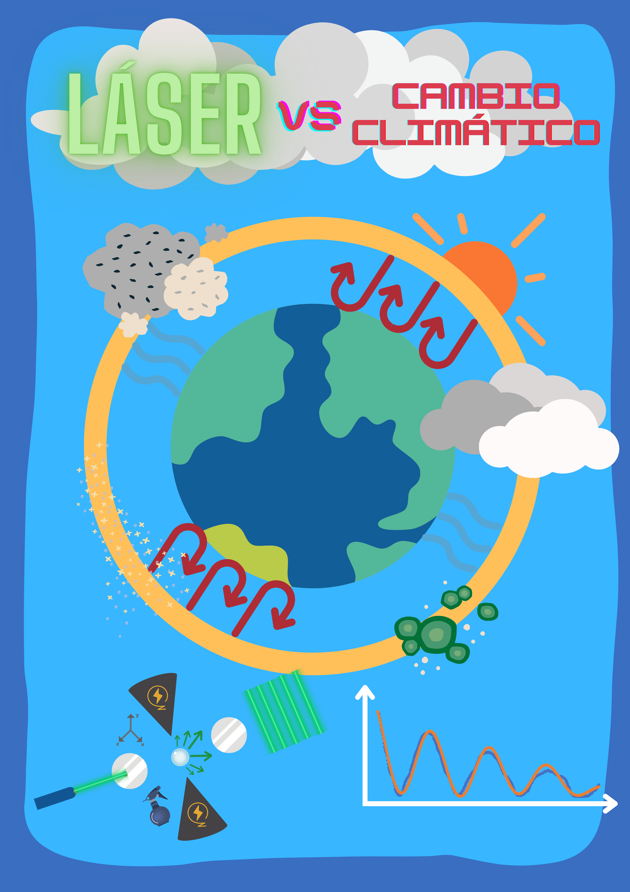
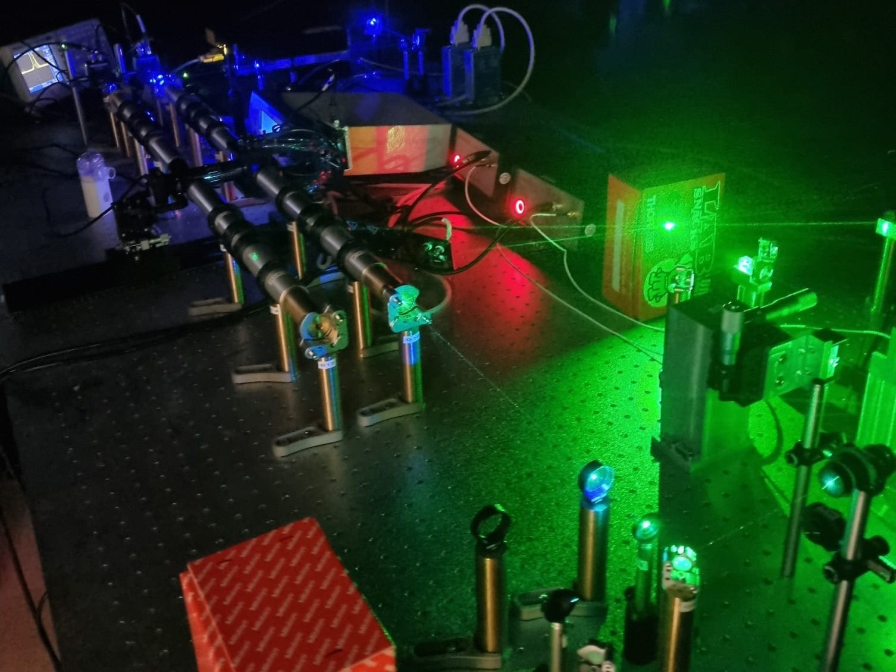
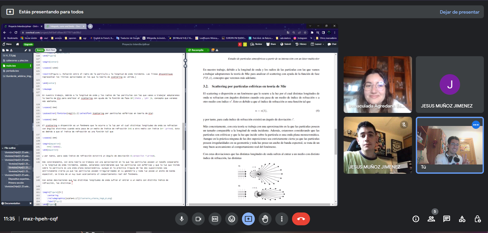

Proyecto en Física

# Estudio de partículas atmosféricas a partir de su interacción con un láser multicolor

## Primera Edición: Curso 2022/2023

### Alumnado encargado del proyecto

Este proyecto se lleva a cabo gracias al trabajo y dedicación de dos estudiantes de Estadística, un  estudiante de Física y un estudiante de Óptica.

##### Inmaculada Agredano Espinal

Alumna del grado en Estadística

##### Jesús Muñoz Jiménez

Alumno del grado en Óptica y Optometría

##### Jorge Luis Jiménez da Silva

Alumno del grado en Física

##### Francisco Luis Navarro Martínez

Alumno del grado en Estadística 

### Profesorado

##### María José Granados Muñoz

Profesora contratada doctora indefinida, Departamento de Física Aplicada

###### [mjgranados@ugr.es](mailto:mjgranados@ugr.es)

##### Antonio Valenzuela Gutiérrez

Profesor contratado doctor indefinido, Departamento de Física Aplicada

###### [avalenzuela@ugr.es](mailto:avalenzuela@ugr.es)

##### María José Cáceres Granados

Profesora titular de universidad, Departamento de Matemática Aplicada

###### [caceresg@ugr.es](mailto:caceresg@ugr.es)

##### Juan Campos Rodríguez

Catedrático de universidad, Departamento de Matemática Aplicada

###### [campos@ugr.es](mailto:campos@ugr.es)

##### Ana Belén López Baldomero

Contratos predoctorales ley 14/2011 FPU, Departamento de Óptica

###### [anabelenlb@ugr.es](mailto:anabelenlb@ugr.es)

##### Nuria Rico Castro

Profesora contratada doctora indefinida, Departamento de Estadística e Investigación Operativa

###### [nrico@ugr.es](mailto:nrico@ugr.es)

Metas alcanzadas

Se ha adaptado un código númerico, basado en la teoría de Mie y escrito en lenguaje FORTRAN, a las características de la trampa empleada para determinar las funciones de fase teóricas, para distintos radios e índices de refracción. Se ha obtenido una colección de datos de fases teóricas, en función del ángulo de dispersión, haciendo un barrido en un rango de radios e índices de refracción. Los datos de las funciones de fase teóricas se trataron a través del programa de hojas de cálculo Excel, calculando el error cuadrático medio (ECM) y el error cuadrático medio  
relativo (RMSE) respeto a los datos experimentales. De este modo se determinaron los valores para el radio e ı́ndice de refracción que mejor se ajustaban a los datos experimentales.

### Camino por recorrer

El código numérico se puede mejorar para hacer más eficiente la recogida de datos teóricos. La búsqueda de la mejor aproximación para determinar el radio y el índice de refracción de la partícula es también mejorable. Se han estudiado sólo las características ópticas y microfísicas de una partícula concreta en un instante determinado. En la segunda fase del proyecto se espera poder estudiar la evolución temporal de la partícula para analizar cómo cambian sus propiedades.

### Opiniones Anónimas Del Alumnado​

**Cuando te apuntaste al curso ¿imaginaste que sería como finalmente ha sido?**  
"Pues tenía una idea parecida a lo que fue el planteamiento inicial del curso." **¿Qué es lo que más te ha gustado del curso?** "La idea principal del proyecto, el poder compartir el gusto por la ciencia con estudiantes de otros grados y buscar la forma de explicarles algo más o menos complejo tratando de encontrar un lenguaje común. Ya que normalmente he tratado de explicar conceptos únicamente a estudiantes de mi grado." **¿Qué crees que se podría mejorar/ampliar?** "Si se continuase este proyecto, creo que tendría que hacerse un barrido de más muestras y láseres, y centrarse en el análisis de las consecuencias climáticas." **¿Cómo te has sentido en el grupo (con el resto de estudiantes y con el profesorado)?** "Bastante cómodo. Se consiguió un buen ambiente de trabajo y de compañerismo entre los integrantes del grupo desde el principio."Previous image Next image

## Únete

###### ¿Te interesa este proyecto? Escribe a su persona de contacto:

##### [mjgranados@ugr.es](mailto:mjgranados@ugr.es)
