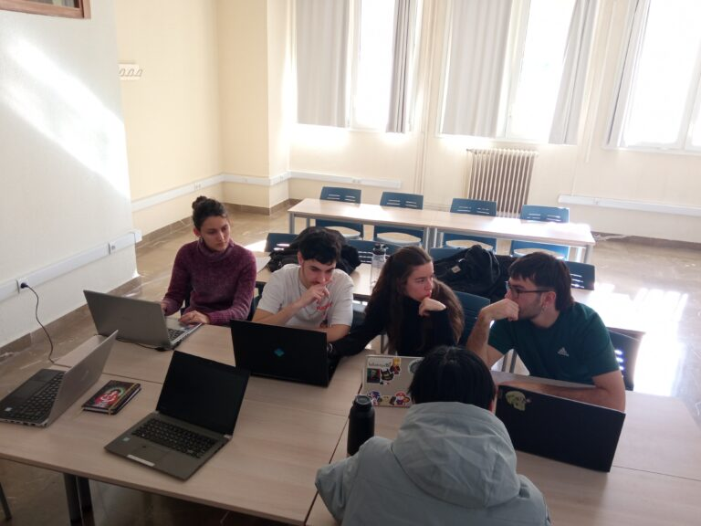

Proyecto en Física

# Estudio de partículas atmosféricas a partir de su interacción con un láser multicolor

## Segunda Edición: Curso 2023/2024

### Alumnado encargado del proyecto

Este proyecto se lleva a cabo gracias al trabajo y dedicación de cuatro alumnos de física, una de matemáticas y uno de física y matemáticas.

##### Fernando Cordero Martín

Alumno del Grado en Física

##### Jin Chengyu

Alumnx del Grado en Física 

##### Esther Torralba Delgado

Alumna del Grado en Física

##### Alba Díez Santos

Alumna del Grado en Matemáticas

##### Elena Ríos Martin

Alumna del Grado en Física 

##### José Manuel Montes Armenteros

Alumno del Doble Grado en Física y Matemáticas 

### Profesorado

##### María José Granados Muñoz

Profesora contratada doctora indefinida, Departamento de Física Aplicada

###### [mjgranados@ugr.es](mailto:mjgranados@ugr.es)

##### Antonio Valenzuela Gutiérrez

Profesor contratado doctor indefinido, Departamento de Física Aplicada

###### [avalenzuela@ugr.es](mailto:avalenzuela@ugr.es)

##### María José Cáceres Granados

Profesora titular de universidad, Departamento de Matemática Aplicada

###### [caceresg@ugr.es](mailto:caceresg@ugr.es)

##### Juan Campos Rodríguez

Catedrático de universidad, Departamento de Matemática Aplicada

###### [campos@ugr.es](mailto:campos@ugr.es)

##### Ana Belén López Baldomero

Contratos predoctorales ley 14/2011 FPU, Departamento de Óptica

###### [anabelenlb@ugr.es](mailto:anabelenlb@ugr.es)

### Metas alcanzadas en esta fase

...

### Camino por recorrer

...

### Opiniones anónimas del alumnado

**¿...?**

"..."

**¿...?**

"...."

**¿...?**

"..."

**¿...?**

"...."

## Únete

###### ¿Te interesa este proyecto? Escribe a su persona de contacto:

##### [mjgranados@ugr.es](mailto:mjgranados@ugr.es)
