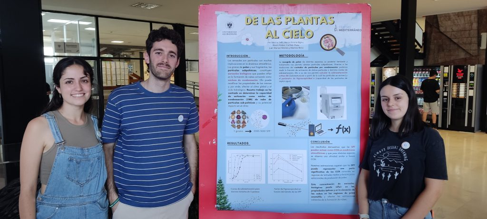
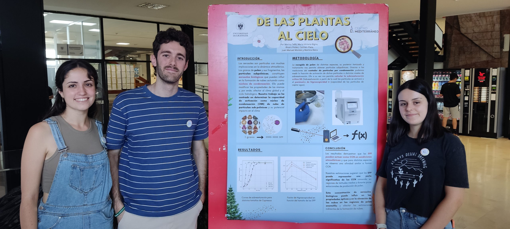
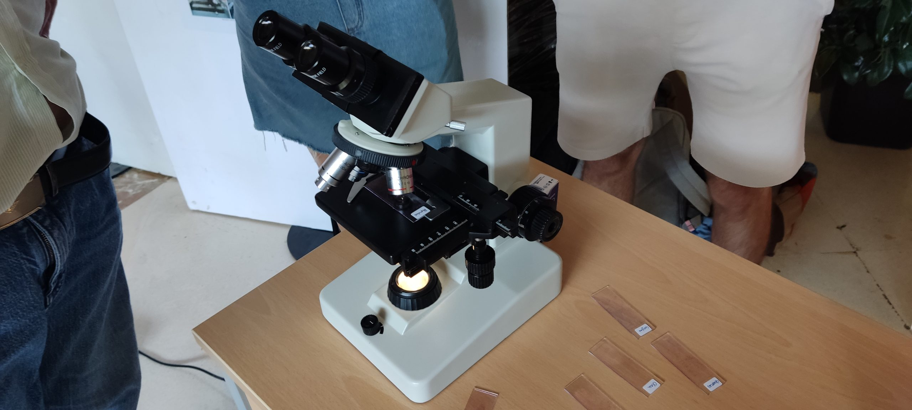

Proyecto en Física

# Entre la física y la biología: el papel del polen en la formación de nubes y el clima

## Primera Edición: Curso 2022/2023

### Alumnado encargado del proyecto

Este proyecto se lleva a cabo gracias al trabajo y dedicación de cuatro estudiantes de biología, una estudiante de estadística, un estudiante de matemáticas y un estudiante del máster 'Fisymat'.

##### María Victoria Bignú

Alumna del Grado en Biología

##### Juan Manuel Montes López

Alumno del Máster FisyMat

##### Marina Tello Madueño

Alumna del Grado en Biología

##### Carmen Plata Fernández

Alumna del Grado en Estadística

##### Josep Marti Puig

Alumno del Grado en Biología

##### Álvaro Peláez Pérez

Alumno del Grado en Biología

##### Martina Riera Ojea

Alumna del Grado en Matemáticas 

### Profesorado

##### Paloma Cariñanos González

Profesora titular de Universidad, Departamento de Botánica

###### [palomacg@ugr.es](mailto:palomacg@ugr.es)

##### Gloria Titos Vela

Profesora contratada doctora indefinida, Departamento de Física Aplicada

###### [gtitos@ugr.es](mailto:gtitos@ugr.es)

##### Juan Campos Rodríguez

Catedrático de Universidad, Departamento de Matemática Aplicada

###### [campos@ugr.es](mailto:campos@ugr.es)

##### Nuria Rico Castro

Profesora doctora contratada indefinida, Departamento de Estadística e Investigación Operativa

###### [nrico@ugr.es](mailto:nrico@ugr.es)

##### Margarita Arias López

Profesora titular de Universidad, Departamento de Matemática Aplicada

###### [marias@ugr.es](mailto:marias@ugr.es)

### Metas alcanzadas en esta fase

Las alumnas y alumnos han generado un código en Python que les permitía analizar los datos medidos en laboratorio para determinar la fracción de activación, sobresaturación crítica y factor de higroscopicidad de 4 tipos polínicos diferentes, característicos del área de Granada. Así mismo, han conocido de primera mano la tarea de recoger muestras de polen y su posterior análisis, y han visitado las instalaciones del laboratorio de física de la atmósfera del Instituto Interuniversitario de Investigación del Sistema Tierra en Andalucía (IISTA), donde se encuentra el instrumento para medir núcleos de condensación de nubes.

### Camino por recorrer

Durante este primer proyecto nos hemos centrado en formación de gotas de agua (estado líquido) a partir de un núcleo de polen obteniendo resultados muy prometedores. En esta segunda fase del proyecto estudiaremos la fase sólida de la nube, y nos centraremos en la capacidad del polen de activarse como cristal de hielo utilizando un espectrómetro de núcleos de hielo. Este dispositivo está en proceso de desarrollo en el grupo de física de la atmósfera y los estudiantes participarán de forma activa en su desarrollo, puesta a punto y realización de primeras medidas.

### Opiniones Anónimas Del Alumnado​

"." "." "." "."

## Únete

###### ¿Te interesa este proyecto? Escribe a su persona de contacto:

##### [gtitos@ugr.es](mailto:gtitos@ugr.es)
