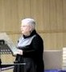

Proyecto en Física

#### Entre la física y la biología: el papel del polen en la formación de nubes y el clima

## Segunda Edición: Curso 2023/2024

#### Alumnado encargado del proyecto

Este proyecto se lleva a cabo gracias al trabajo y dedicación de ...

##### José Luis Aguilera López

Alumno del Grado en ...

##### Oskar Borgvall González

Alumno del Grado en Física

##### Lola Castellón Ruiz

Alumna del Grado en ...

##### Jesús García Sánchez

Alumno del Grado en ... 

##### Claudia González Arnaiz

Alumna del Grado en ...

##### Daniel Sánchez Correa

Alumno del Grado en ...

### Profesorado

##### Paloma Cariñanos González

Profesora titular de Universidad, Departamento de Botánica

###### [palomacg@ugr.es](mailto:palomacg@ugr.es)

##### Gloria Titos Vela

Profesora contratada doctora indefinida, Departamento de Física Aplicada

###### [gtitos@ugr.es](mailto:gtitos@ugr.es)

##### Alberto Cazorla Cabrera

Profesor titular de Universidad, Departamento de Física Aplicada

###### [cazorla@ugr.es](mailto:campos@ugr.es)

##### Nuria Rico Castro

Profesora doctora contratada indefinida, Departamento de Estadística e Investigación Operativa

###### [nrico@ugr.es](mailto:nrico@ugr.es)

##### Margarita Arias López

Profesora titular de Universidad, Departamento de Matemática Aplicada

###### [marias@ugr.es](mailto:marias@ugr.es)

##### Elena Bazo Gonzalez

Profesora Predoctoral

###### [ebazo@ugr.es](mailto:marias@ugr.es)

<figure>

<figcaption>

Imagen de congelación de la disolución de polen tipo populus en las placas PCR a -14ºC (izq: disolución 1:10, dcha:disolución 1:1). Podemos observar cómo algunos pocillos de las placas ya se han congelado, especialmente en la disolución 1:1.

</figcaption>

</figure>

<figure>

<figcaption>

Espectrómetro de núcleos de hielo GRAINS

</figcaption>

</figure>

<figure>

<figcaption>

Alumno del proyecto pipeteando la solución de polen en las placas PCR para estudiar su capacidad de activación en el espectrómetro de núcleos de hielo GRAINS.

</figcaption>

</figure>

### Metas alcanzadas en esta fase

...

### Camino por recorrer

...

#### Opiniones anónimas del alumnado

**¿...?**

"..."

**¿...?**

"...."

**¿...?**

"..."

**¿...?**

"...."

## Únete

###### ¿Te interesa este proyecto? Escribe a su persona de contacto:

##### [gtitos@ugr.es](mailto:gtitos@ugr.es)
