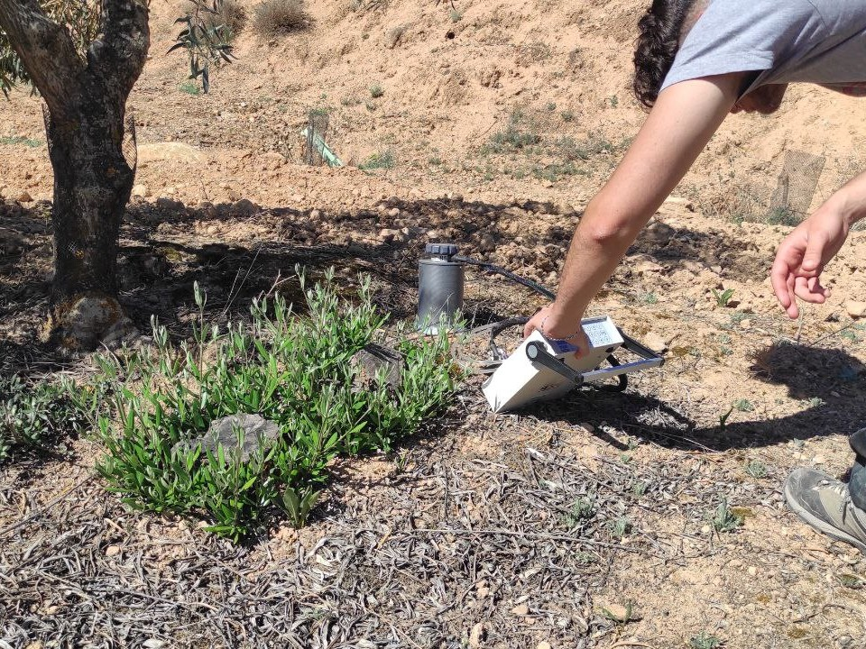

Proyecto en Biología

# Diferencias en la respiración de un suelo agrícola según el tipo de uso del suelo

## Primera Edición: Curso 2022/2023

### Alumnado encargado del proyecto

Este proyecto se lleva a cabo gracias al trabajo y dedicación de 3 estudiantes de biología/ciencias ambientales y 3 estudiantes de Matemáticas/Estadística.

##### Javier Cabezas Berrido

Alumno del Grado en Biología

##### María José Pérez Martín

Alumna del Grado en Ciencias Ambientales

##### Alberto Aguilar Romero

Alumno del Grado en Matemáticas

##### Elena Beltrán Gallego

Alumna del Grado en Biología

##### Víctor Ramírez Sáez

Alumno del Grado en Estadística 

### Profesorado

##### Fabián Casas Arenas

Profesor Sustituto Interino, Departamento de Zoología

###### [fcasas@ugr.es](mailto:fcasas@ugr.es)

##### Margarita Arias López

Profesora titular de universidad, Departamento de Matemática Aplicada

###### [marias@ugr.es](mailto:marias@ugr.es)

##### Juan Campos Rodríguez

Catedrático de universidad, Departamento de Matemática Aplicada

###### [campos@ugr.es](mailto:campos@ugr.es)

##### Penélope Serrano Ortiz

Profesor titular de universidad, Departamento de Ecología

###### [penelope@ugr.es](mailto:penelope@ugr.es)

##### Nuria Rico Castro

Profesora Contratada Doctora Indefinida, Departamento de Estadística e Investigación Operativa

###### [nrico@ugr.es](mailto:nrico@ugr.es)

##### Ana Romero Freire

Programa de Investigadoras Emergentes, Departamento de Edafología y Química Agrícola

###### [anaromerof@ugr.es](mailto:anaromerof@ugr.es)

### Metas alcanzadas

Hasta ahora, hemos recorrido un largo camino. Hemos trabajado en equipo, desde la toma de decisiones estratégicas en el laboratorio hasta las mediciones en el campo bajo el ardiente sol de Granada. Hemos realizado cálculos matemáticos y estadísticos para validar nuestros hallazgos. Nuestra iniciativa interdisciplinaria ha demostrado ser valiosa en cada paso del camino.

### Camino por recorrer

Pero este es solo el comienzo. Queda mucho por descubrir. ¿Cómo influyen las condiciones climáticas y las estaciones en estas mediciones? ¿Podemos encontrar fórmulas matemáticas para corregir estas variables y comparar datos de diferentes momentos en el tiempo? Además, debemos considerar otras facetas del suelo, como su estructura, humedad o la diversidad microbiana. Estos detalles nos ayudarán a comprender más profundamente por qué se producen variaciones en la respiración en diferentes zonas de estudio.  
Este viaje nos lleva a un territorio inexplorado, donde el suelo se convierte en un libro abierto lleno de historias asombrosas. Con cada paso que damos, estamos un paso más cerca de comprender y preservar la salud del suelo, un recurso fundamental para nuestra propia existencia.

### Opiniones Anónimas Del Alumnado​

**Cuando te apuntaste al curso ¿imaginaste que sería como finalmente ha sido?** "No, me ha gustado más de lo que esperaba. ." **¿Cómo te has sentido en el grupo (con el resto de estudiantes y con el profesorado)?** "Muy cómoda y a gusto, me he sentido incluida en un grupo que hemos formado todos (alumnos y profesores)." **¿Cómo crees que ha influido tu disciplina de estudio en el desarrollo del curso?** "Sí, ya que el proyecto trata en gran medida de cuestiones que se tienen que ver con la biología, sin embargo han sido igual de necesarias todas las disciplinas que han participado." **¿Qué es lo que más te ha gustado del curso?** "Poder trabajar en un equipo interdisciplinar y haber conocido a gente de otras carreras. Me ha hecho darme cuenta del gran mundo que hay en cada uno de los grados. Otro aspecto que me ha gustado mucho ha sido la cercanía de los profesores y que han estado presentes a lo largo de todo el proyecto. Me ha gustado también poder haber profundizado en temas que son más ajenos a mi grado y dar un paso más adelante en mi entendimiento de estos. La oportunidad de exponer en el póster en el Festival Académico también ha sido muy gratificante, exponer nuestro trabajo a aquellas personas que estaban interesadas."Previous image Next image

## Únete

###### ¿Te interesa este proyecto? Escribe a su persona de contacto:

##### [penelope@ugr.es](mailto:penelope@ugr.es)
