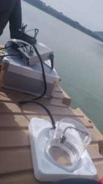
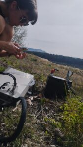

Proyecto en Biología

#### Diferencias en la respiración de un suelo agrícola según el tipo de uso del suelo

## Segunda Edición: Curso 2023/2024

#### Alumnado encargado del proyecto

Este proyecto se lleva a cabo gracias al trabajo y dedicación de ...

##### Ariadna Herruzo Estrada

Alumna del Grado en ...

##### Miguel Ángel Jiménez López

Alumno del Grado en ...

##### Pablo Orellana Chornyak

Alumno del Grado en ...

##### María del Carmen Ramírez Trujillo

Alumna del Grado en ...

##### Taisiia Stetiukha Romanovna

Alumna del Grado en ...

##### Marc Planells Pelegrín

Alumno del Grado en ...  

### Profesorado

##### Fabián Casas Arenas

Profesor Sustituto Interino, Departamento de Zoología

###### [fcasas@ugr.es](mailto:fcasas@ugr.es)

##### Margarita Arias López

Profesora titular de universidad, Departamento de Matemática Aplicada

###### [marias@ugr.es](mailto:marias@ugr.es)

##### Juan Campos Rodríguez

Catedrático de universidad, Departamento de Matemática Aplicada

###### [campos@ugr.es](mailto:campos@ugr.es)

##### Penélope Serrano Ortiz

Profesor titular de universidad, Departamento de Ecología

###### [penelope@ugr.es](mailto:penelope@ugr.es)

##### Nuria Rico Castro

Profesora Contratada Doctora Indefinida, Departamento de Estadística e Investigación Operativa

###### [nrico@ugr.es](mailto:nrico@ugr.es)

##### Ana Romero Freire

Programa de Investigadoras Emergentes, Departamento de Edafología y Química Agrícola

###### [anaromerof@ugr.es](mailto:anaromerof@ugr.es)

### Metas alcanzadas en esta fase

...

### Camino por recorrer

...

#### Opiniones anónimas del alumnado

**¿...?**

"..."

**¿...?**

"...."

**¿...?**

"..."

**¿...?**

"...."

## Únete

###### ¿Te interesa este proyecto? Escribe a su persona de contacto:

##### [penelope@ugr.es](mailto:penelope@ugr.es)
