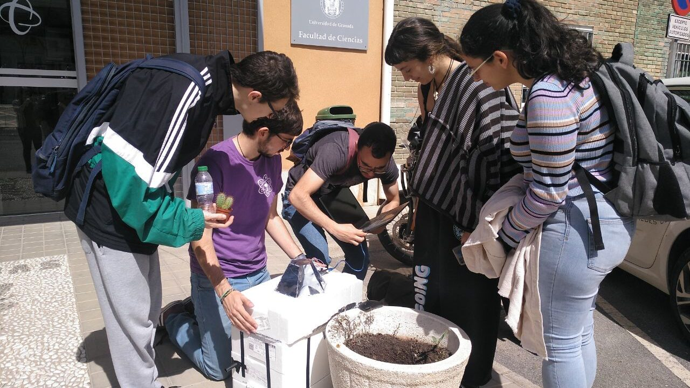

Proyecto en Óptica

#### Conduciendo la luz natural para el desarrollo de vegetación subterránea

## Primera Edición: Curso 2022/2023

#### Alumnado encargado del proyecto

Este proyecto se lleva a cabo gracias al trabajo y dedicación de un estudiante de física, dos estudiantes de ciencias ambientales, dos estudiantes de matemáticas y una estudiante de óptica.

##### Jorge Buenestado Domínguez

Alumno del grado en Física

##### Lucía García Fernández-Santaella

Alumna del Grado en Física

##### Miguel Roldán Rosales

Alumno del Grado en Matemáticas

##### Rocío Cadenas Pacheco

Alumna del Grado en Ciencias Ambientales

##### Daniel Rodríguez Aguilar

Alumno del grado en Matemáticas

##### Ginés Santiago Gras Alix

Grado en Ciencias Ambientales 

### Profesorado

##### María José Granados Muñoz

Profesora contratada doctora indefinida, Departamento de Física Aplicada

###### [mjgranados@ugr.es](mailto:mjgranados@ugr.es)

##### María de la Natividad Tejada Casado

Profesora Sustituta Interina, Departamento de Óptica

###### [mariatejadac@ugr.es](mailto:mariatejadac@ugr.es)

##### María José Cáceres Granados

Profesora titular de universidad, Departamento de Matemática Aplicada

###### [caceresg@ugr.es](mailto:caceresg@ugr.es)

##### Lidia Fernádez Rodríguez

Profesora titular de universidad, Departamento de Matemática Aplicada

###### [lidiafr@ugr.es](mailto:lidiafr@ugr.es)

##### Ana Belén López Baldomero

Contratos predoctorales ley 14/2011 FPU, Departamento de Óptica

###### [anabelenlb@ugr.es](mailto:anabelenlb@ugr.es)

##### Pilar Granados Delgado

Profesora sustituta interina, Departamento de Óptica

###### [pilargrd@ugr.es](mailto:pilargrd@ugr.es)

### Objetivos

El objetivo principal del proyecto se centró en el estudio de la luz natural para conseguir el crecimiento de vegetación subterránea. Para ello, estudiantes de distintos grados (Física, Matemáticas y Ciencias Ambientales) unificaron sus conocimientos para llevar a cabo la construcción de una caja hermética que pudiera simular las condiciones subterráneas, y de un colector de luz capaz de captar la luz exterior y repartirla de manera uniforme dentro de la misma, pudiéndose así cultivar la vegetación deseada. Para alcanzarlo se plantearon los siguientes objetivos secundarios:

1. Construcción de una caja con un sistema de riego que permita simular las condiciones de temperatura y humedad necesarias para el desarrollo de vegetación.
2. Diseño de un dispositivo colector de luz capaz de captar, introducir y repartir la luz natural de forma homogénea.
3. Instalación de un dispositivo de medición para el control de la temperatura, humedad y luminosidad en el interior de la caja.

### Metas alcanzadas

La estructura final del prototipo estaba formada por cuatro cajas de poliestireno. A dos de ellas se le quitaron las bases para así poder apilarlas y recubrirlas con papel de aluminio (para favorecer la reflexión de la luz en su interior) y unirlas entre sí con la mayor hermeticidad posible. Gracias a un tubo de riego por goteo, al cual se le perforaron unos orificios, se llevó a cabo el riego de las plantas del interior de la caja sin necesidad de abrirla. La estructura final del colector de luz fue una columna de espejos que debía estar orientada al sur y cuyas alturas y distancias se calcularon para asegurar que, al reflejarse la luz solar sobre la misma, siempre incidiría sobre el orificio central. Para facilitar la dispersión de la luz de forma homogénea en el interior de la caja se utilizó una lente divergente. Para control de las condiciones de humedad, temperatura y luminosidad se instaló una placa de Arduino con sensores que medían las variables a tiempo real y proyectaba los valores en una pantalla LCD instalada en el exterior.

### Camino por recorrer

Optimizar la caja para que pueda transpirar favoreciendo así que las condiciones de humedad en su interior no supongan un problema. Se podría mejorar el prototipo del colector, ya sea utilizando materiales de mayor calidad o cambiando su diseño (por ejemplo, por un heliostato). Además, se podría diseñar un dispositivo capaz de repartir la luz de manera homogénea en el interior de la caja. 

### Opiniones anónimas del alumnado

**¿Cómo crees que ha influido tu disciplina de estudio en el desarrollo del curso?** "Pienso que mi razonamiento matemático ha beneficiado en los cálculos ópticos y fí­sicos."**¿Cómo te has sentido en el grupo (con el resto de estudiantes y con el profesorado)?** "Me he sentido incluido, pues mis ideas han sido escuchadas por mis compañeros y las profesoras, y mis horarios de estudio y exámenes han sido respetados."**¿Imaginaste que serí­a como finalmente ha sido?** "Ha sido una gran experiencia puesto que he podido hacerme una idea de en qué consiste un trabajo de investigación"**¿Cómo te has sentido en el grupo (con el resto de estudiantes y con el profesorado)?** "Muy cómoda y escuchada tanto por los estudiantes como por el profesorado"

## Únete

###### ¿Te interesa este proyecto? Escribe a su persona de contacto:

##### [mariatejadac@ugr.es](mailto:mariatejadac@ugr.es)
