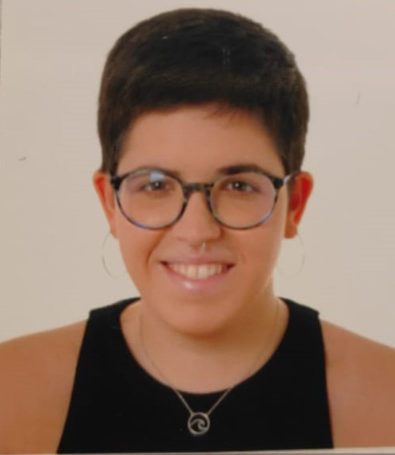
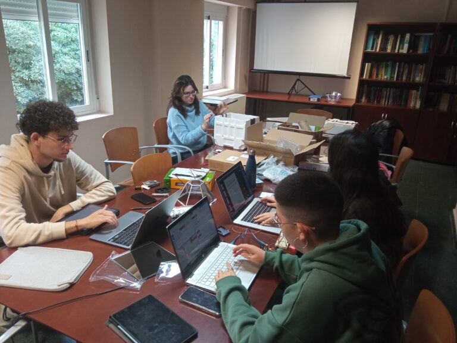
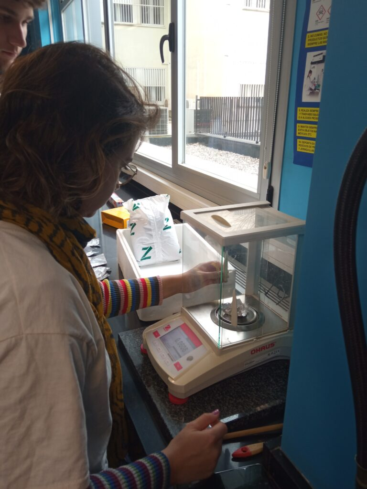
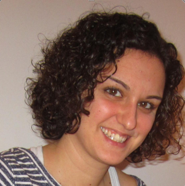
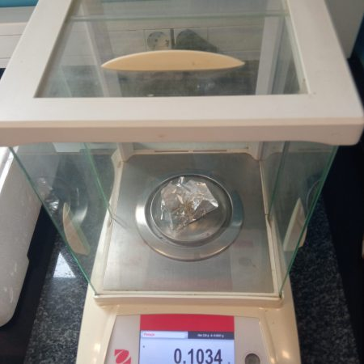
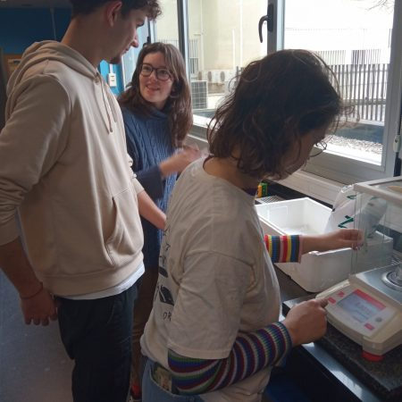
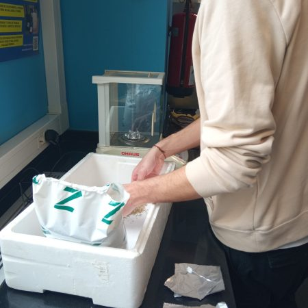
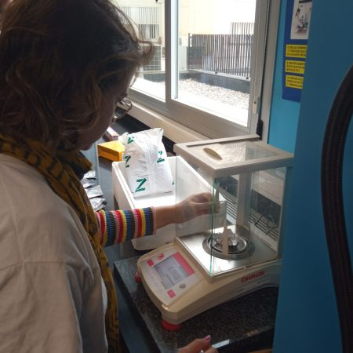

Proyecto en Óptica

#### Conduciendo la luz natural para el desarrollo de vegetación subterránea

## Segunda Edición: Curso 2023/2024

#### Alumnado encargado del proyecto

Este proyecto se lleva a cabo gracias al trabajo y dedicación de ...

##### Adrián Carballo Carballo

Alumno del Grado en ... 

##### Alhambra Espigares García

Alumna del Grado en Matemáticas

##### Lucía López González

Alumna del Grado en ...

##### Pilar Pérez Abellán

Alumna del Grado en ...

##### Lucía Sánchez Plata

Alumna del Grado en ...  

### Profesorado

##### María José Granados Muñoz

Profesora contratada doctora indefinida, Departamento de Física Aplicada

###### [mjgranados@ugr.es](mailto:mjgranados@ugr.es)

##### María de la Natividad Tejada Casado

Profesora Sustituta Interina, Departamento de Óptica

###### [mariatejadac@ugr.es](mailto:mariatejadac@ugr.es)

##### María José Cáceres Granados

Profesora titular de universidad, Departamento de Matemática Aplicada

###### [caceresg@ugr.es](mailto:caceresg@ugr.es)

##### Paloma Cariñanos González

Profesora titular de universidad, Departamento de Botánica

###### [palomacg@ugr.es](mailto:lidiafr@ugr.es)

##### Ana Belén López Baldomero

Contratos predoctorales ley 14/2011 FPU, Departamento de Óptica

###### [anabelenlb@ugr.es](mailto:anabelenlb@ugr.es)

### Metas alcanzadas en esta fase

...

### Camino por recorrer

...

#### Opiniones anónimas del alumnado

**¿...?**

"..."

**¿...?**

"...."

**¿...?**

"..."

**¿...?**

"...."

## Únete

###### ¿Te interesa este proyecto? Escribe a su persona de contacto:

##### [mariatejadac@ugr.es](mailto:mariatejadac@ugr.es)
